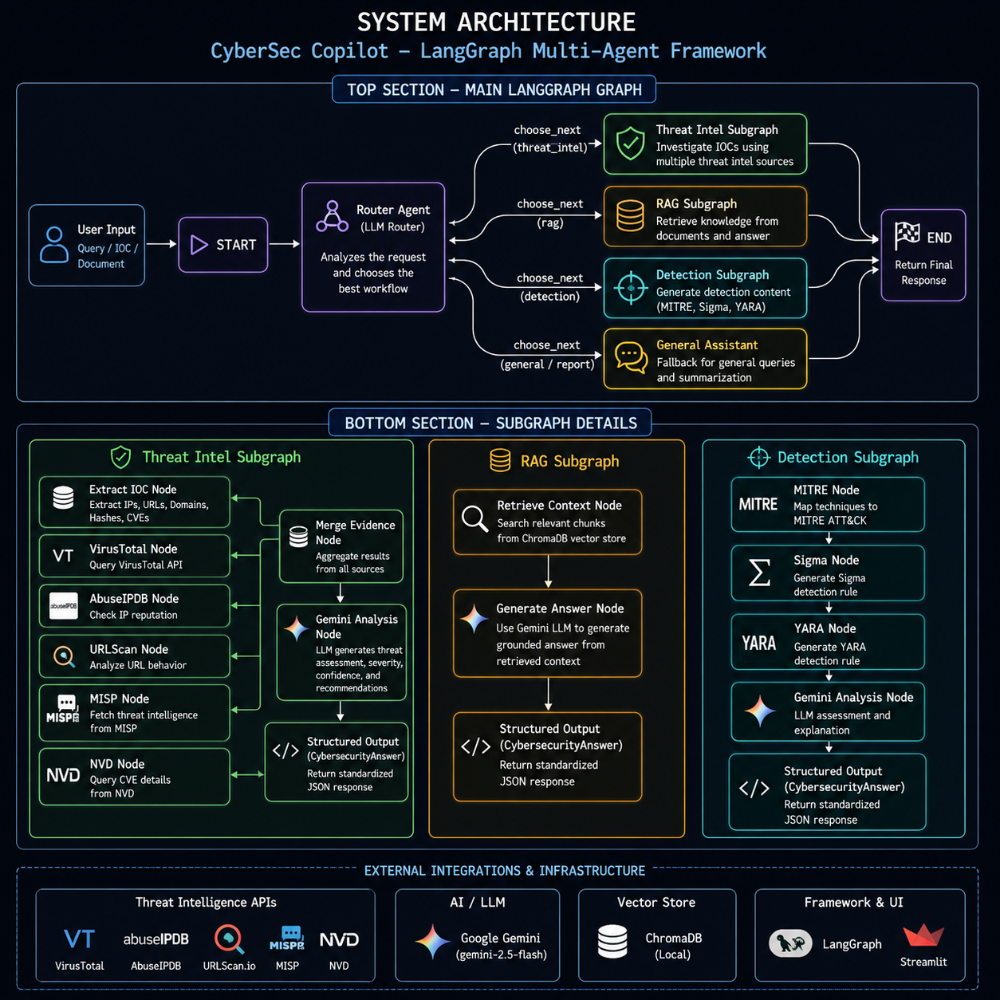

<div align="center">

# 🛡️ CyberSec Copilot

### AI-Powered Cybersecurity Investigation & Threat Intelligence Assistant

Built with **LangGraph • Google Gemini • Streamlit • ChromaDB • MISP • VirusTotal • AbuseIPDB • URLScan • NVD**

---

An AI-powered Cybersecurity Copilot that automates **Threat Intelligence Investigation**, **Detection Engineering**, and **RAG-based Security Knowledge Retrieval** through intelligent multi-agent workflows.

</div>

---

#  Overview

Security analysts often spend significant time manually checking multiple threat intelligence platforms, searching security documentation, and writing detection rules.

CyberSec Copilot automates these repetitive tasks by intelligently routing user requests to specialized AI workflows using **LangGraph**.

The application can:

-  Investigate IP addresses
-  Investigate Domains
-  Investigate URLs
-  Investigate CVEs
-  Investigate File Hashes
-  Answer questions from uploaded security policies (RAG)
-  Generate Sigma Rules
-  Generate YARA Rules
-  Map threats to MITRE ATT&CK

---

#  Features

##  Threat Intelligence Investigation

Automatically investigates:

- IP Addresses
- URLs
- Domains
- File Hashes
- CVEs

using multiple threat intelligence providers.

---

##  Threat Intelligence Integrations

The application aggregates intelligence from:

- VirusTotal
- AbuseIPDB
- URLScan.io
- National Vulnerability Database (NVD)
- MISP Threat Intelligence Platform

All intelligence is merged into a single AI-generated investigation report.

---

##  AI Threat Assessment

Google Gemini analyzes the collected evidence and generates:

- Executive Summary
- Threat Severity
- Confidence Score
- IOC Summary
- Security Recommendations

---

##  Retrieval-Augmented Generation (RAG)

Upload security documents such as:

- Security Policies
- Compliance Documents
- Framework Documentation
- PDFs

The assistant stores document embeddings in **ChromaDB** and answers questions using Retrieval-Augmented Generation.

---

##  Detection Engineering

Automatically generates:

- Sigma Rules
- YARA Rules
- MITRE ATT&CK Mapping

from security incidents and threat descriptions.

---

##  Intelligent Routing

Instead of sending every request to a single LLM prompt, the application uses **LangGraph StateGraph** to intelligently route user requests into specialized workflows.

---

#  System Architecture


The CyberSec Copilot is built using a LangGraph multi-agent workflow where a router dynamically selects the appropriate security pipeline.

<p align="center">
  
</p>
---

#  Threat Intelligence Workflow

```
User Query
      │
      ▼
Extract IOC
      │
      ▼
VirusTotal
      │
      ▼
AbuseIPDB
      │
      ▼
URLScan
      │
      ▼
MISP
      │
      ▼
NVD
      │
      ▼
Merge Evidence
      │
      ▼
Gemini Threat Assessment
```

---

#  Project Demonstration

The repository includes demonstration videos showing the complete workflow.

###  Threat Intelligence Investigation

Demonstrates:

- IOC Extraction
- VirusTotal Lookup
- AbuseIPDB Lookup
- URLScan Lookup
- MISP Lookup
- AI Threat Summary

---

###  RAG Assistant

Demonstrates:

- Uploading Security Policies
- ChromaDB Retrieval
- Gemini-powered Answers

---

###  Detection Engineering

Demonstrates:

- Sigma Rule Generation
- YARA Rule Generation
- MITRE ATT&CK Mapping

---

#  Tech Stack

### Programming

- Python

### AI

- Google Gemini
- LangChain
- LangGraph

### Vector Database

- ChromaDB

### Frontend

- Streamlit

### Threat Intelligence

- VirusTotal
- AbuseIPDB
- URLScan
- MISP
- NVD

### Detection Engineering

- Sigma
- YARA
- MITRE ATT&CK

---

#  Project Structure

```
CyberSec-Copilot
│
├── assets/
├── docs/
├── src/
│   ├── core/
│   ├── graph/
│   ├── rag/
│   ├── tools/
│   └── tests/
│
├── app.py
├── requirements.txt
├── README.md
├── LICENSE
└── .env.example
```

---

#  Installation

Clone the repository

```bash
git clone https://github.com/satyamshashwat/CyberSec-Copilot.git
```

Move into the project

```bash
cd CyberSec-Copilot
```

Create a virtual environment

```bash
python -m venv .venv
```

Activate the environment

Windows

```bash
.venv\Scripts\activate
```

Linux / macOS

```bash
source .venv/bin/activate
```

Install dependencies

```bash
pip install -r requirements.txt
```

Create a `.env` file using `.env.example`.

Run the application

```bash
streamlit run app.py
```

---

#  Required API Keys

Create a `.env` file and add:

```
GEMINI_API_KEY=

VIRUSTOTAL_API_KEY=

ABUSEIPDB_API_KEY=

URLSCAN_API_KEY=

MISP_URL=

MISP_API_KEY=
```

---

#  How It Works

1. User submits a cybersecurity query.
2. LangGraph Router determines the intent.
3. Appropriate workflow is selected.
4. Threat Intelligence APIs or RAG pipeline execute.
5. Gemini analyzes collected evidence.
6. Final investigation report is displayed.

---

#  Future Improvements

- Shodan Integration
- GreyNoise Integration
- AlienVault OTX Integration
- Hybrid Search
- Multi-Agent Collaboration
- SIEM Integrations
- Automated Incident Response
- Malware Sandbox Integration

---

#  Learning Outcomes

This project helped me gain hands-on experience with:

- Agentic AI
- LangGraph
- LangChain
- Retrieval-Augmented Generation (RAG)
- Prompt Engineering
- Threat Intelligence
- Detection Engineering
- API Integration
- Vector Databases
- Streamlit Development

---

#  License

This project is licensed under the **MIT License**.

---

#  Author

## Satyam Shashwat

**B.Tech Electronics & Telecommunication Engineering**

🔗 LinkedIn

https://www.linkedin.com/in/satyam-shashwat-38a5a6259

---

 If you found this project interesting, consider giving it a star!
